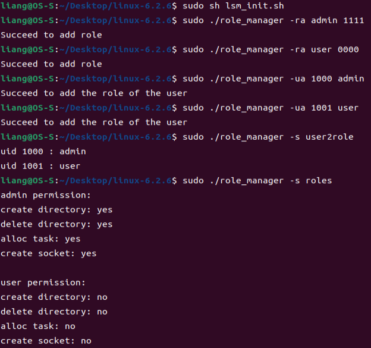
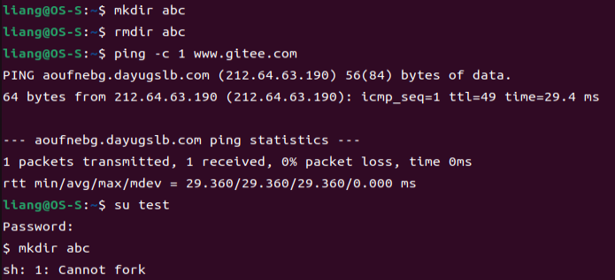
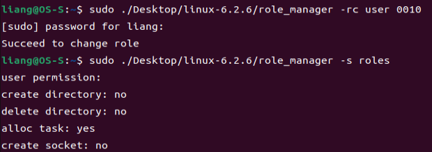
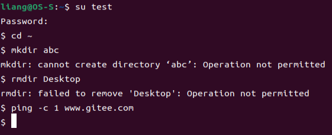
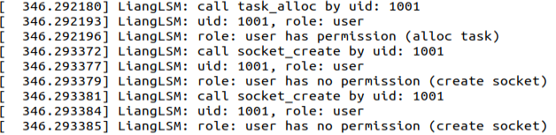

# RBAC访问控制实验报告

## RBAC简介
RBAC全称为用户角色权限控制。在RBAC模型中有3个基础组成部分：用户（User）、角色（Role）、权限（Permission）。管理员需要维护用户-角色和角色-权限之间的映射关系。RBAC通过定义角色的权限，并对用户授予某个角色从而控制用户的权限，实现了用户和权限的逻辑分离。简化了用户和权限的关系，易扩展、易维护。

## LSM简介
在2001年的Linux Kernel峰会上，NSA代表建议在Linux Kernel 2.5中加入SELinux。然而，这一提议遭到了Linus Torvalds的拒绝。一方面，SELinux并不是唯一用于增强Linux安全性的安全子系统；另一方面，并不是所有的开发人员都认为SELinux是最佳解决方案。最终SELinux没能加入到Linux Kernel 2.5，取而代之的是Linux Security Module的开发被提上日程。LSM子系统自提出后开发了近3年，并终于在Linux Kernel 2.6正式加入到内核中，随之应运而生了大量LSM，比如Ubuntu、OpenSUSE、SUSE、Debian等发行版中默认的AppArmor，以及RHEL、Fedora、CentOS等发行版中默认的SELinux。

LSM的钩子函数被插入到访问kernel对象与DAC检查之间，钩子函数可以进行自定义的权限检查。若有多个LSM模块，会根据特定的顺序执行，都允许访问才能进一步访问kernel对象。使用LSM框架进行内核安全审计和元数据捕获时，安全开发人员只需要按照既定的调用规范编写LSM模块，并编译进Linux内核，而不需要对系统调用表进行任何修改。

## 策略管理
管理员可以通过`role_manager`程序控制RBAC系统的使能（`control`）、用户和角色的映射（`user2role`）、角色和权限的映射（`role2permission`），以上内容以文件的形式存储在`etc/LiangLSM`目录下。以下为`role_manager`程序的使用方法，`permission`为位向量，每一位的0或者1表示对应权限的打开或者关闭。权限列表可参考全局变量`permission_list`。
| 参数 | 功能 |
| -- | -- |
| -enable | 打开使能 |
| -disable | 关闭使能 |
| -s user2role | 查看用户和角色的映射 |
| -s roles | 查看角色和权限的映射 |
| -ua uid role | 添加用户 |
| -ud uid | 删除用户 |
| -uc uid role | 更改用户对应角色 |
| -ra role permission | 添加角色 |
| -rd role | 删除用户 |
| -rc role permission | 更改角色对应权限 |

## LSM实现
本项目实现了创建目录（`inode_mkdir`）、删除目录（`inode_rmdir`）、创建进程（`task_alloc`）、创建socket（`socket_create`）的钩子函数，项目可配置性强，只需要增加几行代码即可增加新的钩子函数。

在钩子函数中，用户的uid和操作类型被传入`user_permission`函数中判断操作是否能被执行。在`user_permission`函数中，读取策略文件，判断使能是否打开，获取用户对应的角色，获取角色对应的权限，然后进行判断。

需要注意的是，在高版本的Linux内核中，`get_fs`和`set_fs`函数因为安全原因已被弃用，转而提供`kernel_read`和`kernel_write`函数，供内核读取文件使用。

需要注意的是，在高版本的Linux内核中，LSM的接口定义有较大的改动。开发者需要使用宏`DEFINE_LSM`定义LSM对应的信息，`security_init`函数中会根据这些信息和编译选项来初始化LSM模块。编译选项中需要选择启用的LSM模块以及LSM模块初始化顺序，若多个互斥的LSM模块被选中，只有初始化顺序最前的模块会被启用。

## 验证
本项目使用的内核版本为目前的稳定版6.2.6，Ubuntu版本为目前的稳定版22.04。将LSM模块加入内核后更改`.config`，编译后安装，更新Ubuntu的内核并重启，通过启动信息可以看到LSM模块`LiangLSM`已完成初始化。首先使用脚本创建策略文件所在的文件夹，编译`role_manager`。随后我们添加策略：定义两个角色`admin`和`user`，前者拥有全部权限，后者没有任何权限；将uid 1000分配为admin，将uid 1001分配为user。

使用`admin`角色对应的用户尝试创建目录、删除目录和ping的操作，均成功。使用`user`角色对应的用户尝试创建目录，提示没有创建进程的权限，因为创建目录首先需要创建一个新的进程。

所以我们更改用户对应的权限，赋予创建进程的权限。

随后尝试创建目录、删除目录，均提示失败，ping没有输出。

通过`dmesg`命令查看模块的输出，符合预期。

## 参考资料
1. [RBAC权限系统设计](https://zhuanlan.zhihu.com/p/104849603)
1. [LSM-based-RBAC](https://github.com/guomo233/LSM-based-RBAC)
1. [LSM框架原理解析](https://blog.csdn.net/huzai9527/article/details/119869321)
1. [LSM内核模块实现demo](https://blog.csdn.net/huzai9527/article/details/119870485)
1. [浅谈4.X内核和5.X内核LSM模块初始化差异](https://blog.csdn.net/zerrio/article/details/119779196)
